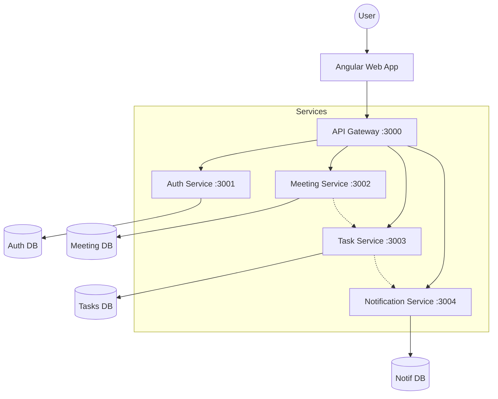

# Architecture Overview

Meeting Memory is built as a **Microservices Monorepo** using [Nx](https://nx.dev). This architecture allows for independent scaling, deployment, and development of different system components while sharing types and utilities.

## System Diagram

## Core Components

### 1. Frontend (Web App)
- **Technology**: Angular 17 (Standalone Components, Signals).
- **Location**: `apps/web`
- **Purpose**: Provides the user interface for calendar management, meeting creation, and task tracking.
- **Communication**: Communicates with the backend services via a centralized API Gateway.

### 2. API Gateway
- **Technology**: Node.js / Express.
- **Location**: `apps/api-gateway`
- **Purpose**: The entry point for all frontend requests. It handles authentication (JWT) and proxies requests to the appropriate microservices.

### 3. Microservices
- **Auth Service** (`apps/auth-service`): Handles user registration, login, and token generation.
- **Meeting Service** (`apps/meeting-service`): Manages the lifecycle of meetings, participants, and search logic.
- **Task Service** (`apps/task-service`): Manages tasks, statuses, and deadlines.
- **Notification Service** (`apps/notification-service`): Handles real-time notifications via SSE (Server-Sent Events) and background watchers.

## Shared Libraries
- **Shared Types** (`libs/shared-types`): Contains Zod schemas and TypeScript interfaces shared between frontend and backend.
- **Shared Utils** (`libs/shared-utils`): Common utility functions (formatting, validation helpers).
- **Problem Details** (`libs/problem-details`): Standardized error handling and middleware following RFC 7807.

## Data Flow
1. User interacts with the **Angular Web App**.
2. Web App sends an HTTP request with a JWT to the **API Gateway**.
3. API Gateway verifies the token and routes the request to the target **Service**.
4. The **Service** interacts with **MongoDB** and returns a response.
